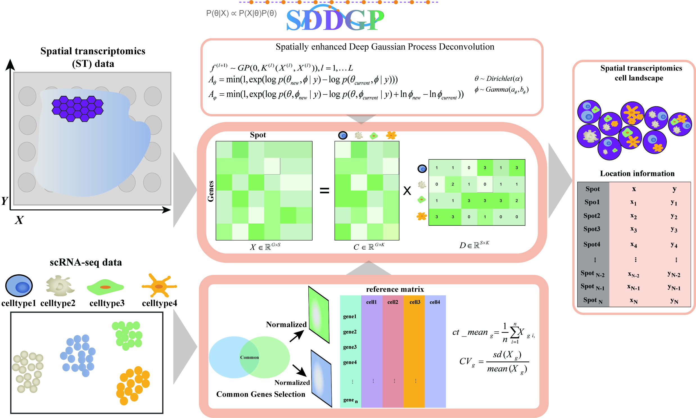

# SDDGP 

**Spatial Deconvolution via Deep Gaussian Processes**

A two-stage Bayesian framework for spatial transcriptomics deconvolution
that provides calibrated posterior uncertainty quantification.

## Overview

SDDGP decomposes each spatial transcriptomics spot into cell-type
proportions through a principled probabilistic pipeline:

1. **Reference construction** — builds a cell type-specific expression
   profile from scRNA-seq, selects informative marker genes, and samples
   pseudo-cells for downstream refinement.

2. **Alpha prior estimation** — derives data-driven Dirichlet
   concentration parameters via information-weighted gene specificity
   and spatial smoothing.

3. **Stage 1: DGP-enhanced MCMC deconvolution** — a 3-layer deep
   Gaussian process encodes spatial correlation as an adaptive prior;
   per-spot Metropolis-Hastings sampling under a negative binomial
   likelihood produces full posterior summaries (mean, SD, 95% CI),
   with split-chain R-hat and bulk ESS convergence diagnostics and
   optional early stopping.

4. **Resolution enhancement** — Matérn-weighted k-NN interpolation
   (CARD-style) expands observed spots onto a dense within-tissue grid.

5. **Stage 2: Single-cell refinement** — cosine similarity-guided
   constrained NNLS maps spot-level proportions to individual
   pseudo-cells, yielding single-cell-resolution assignments.

## Installation

```r
# From GitHub
devtools::install_github("your-username/SDDGP")
```

## Quick start

```r
library(SDDGP)

# 1. Build reference
ref <- buildReferenceMatrix(sc_count, spatial_count, cell_meta,
                            ct_varname = "celltype")

# 2. Compute alpha prior
alpha <- calculateAlpha(ref$basis, sc_count, spatial_coords,
                        concentration = 20)

# 3. Spatial kernel (optional)
ED <- fields::rdist(as.matrix(spatial_coords[, c("x","y")]))
kernel_mat <- maternKernel(ED, range = 5, smoothness = 30)
diag(kernel_mat) <- 0

# 4. Stage 1 deconvolution
stage1 <- runDeconvolution(spatial_count, ref, spatial_coords, alpha,
                           kernel_mat, mcmc_iterations = 3000,
                           early_stop = TRUE)

# 5. Resolution enhancement
enhanced <- enhanceResolution(stage1, ref, spatial_coords,
                              num_grids = 51000)

# 6. Stage 2 refinement
stage2 <- runStage2Refinement(stage1, ref, spatial_count_full)

# Diagnostics
printConvergenceReport(stage1)
plotConvergenceDiagnostics(stage1, spatial_coords)
```

## License

MIT
